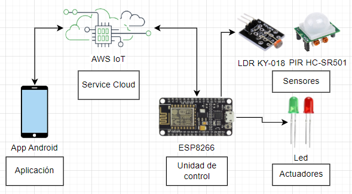

# Aplicativo-IOT-LIGHT
- Aplicativo que emplea: Placa ESP8266, Jetpack Compose, AWS (MQTT Broker)
- Autore: Rony Ventura, Julian Chile, Jesus Begazo y Percy Flores
## Arquitectura y componentes empleados:
  
